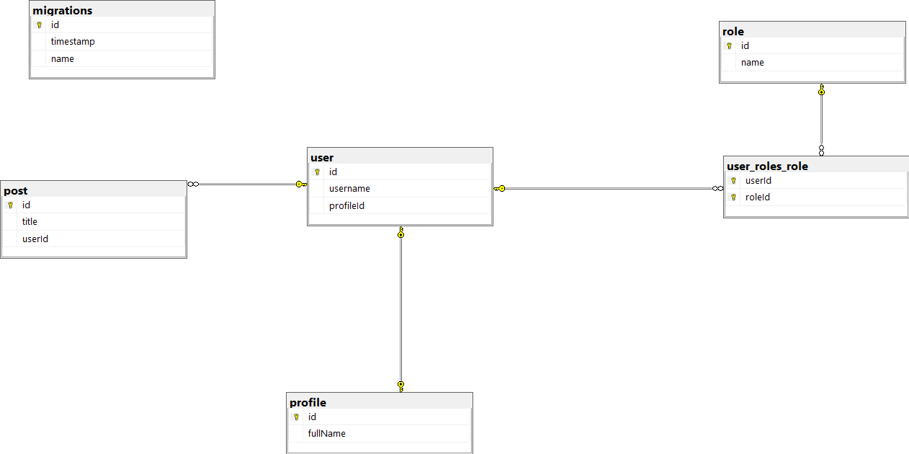

# NestJS Project with TypeORM Migrations Demo

This repository serves as a demonstration for managing database migrations in a NestJS project using TypeORM ORM. It showcases how to synchronize changes in your entities with the corresponding database tables.

## Project Structure

- **Entities**: Contains TypeScript classes representing database entities. These classes define the structure of database tables.
- **Migrations**: Directory where generated migrations are stored. Each migration file corresponds to a set of changes to be applied to the database schema.
- **TypeORM Configuration**: Configuration file (`typeOrm.config.ts`) for TypeORM, defining database connection settings.

## Installation and Setup

1. **Install Dependencies**: Run `npm install` to install project dependencies.

2. **Environment Configuration**: Update the `.env` file according to the provided `.env-template`.

3. **Database Setup**: Run your database using Docker Compose. Use the command `podman compose -f docker-compose.yaml up --detach ` to start the database container.

4. **Apply Migrations**: To update the database with all migrations, run the command:
    ```
    npm run typeorm:run-migration
    ```
5. **Run The Project**:
    ```
    npm start
    ```


## Usage

- **Generating Migrations**: If you make changes to your entities and need to reflect those changes in the database, generate a migration using:
    ```
    npm run typeorm:generate-migration
    ```

  This command generates a migration file in the `migrations` folder. It's recommended to rename the generated file and migration class with appropriate names.

- **Applying Migrations**: To apply migration changes to the database, use:
    ```
    npm run typeorm:run-migration
    ```

- **Reverting Migrations**: If needed, you can revert the last migration applied to the database using:
    ```
    npm run typeorm:revert-migration
    ```

  This command removes the corresponding migration record from the migrations table in the database. You may also delete the appropriate migration file from the `migrations` folder.

- **Creating Empty Migrations**: To create an empty migration, use:
    ```
    npm run typeorm:create-migration
    ```

## Tracking Changes

This project allows you to track how entities with relations (`OneToOne`, `OneToMany`, and `ManyToMany`) are aligned with the database tables. Each commit represents the evolution of entities and their corresponding database schemas.

## Screenshots

